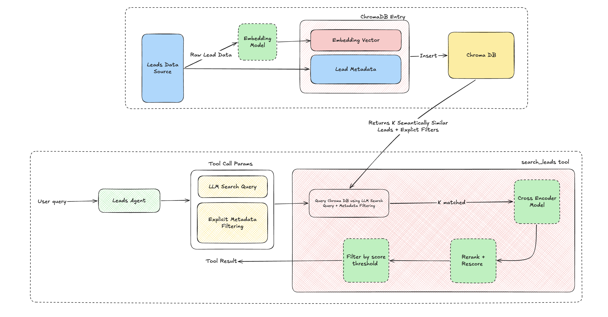

# Project Setup

**Prerequisites:** Python 3.12+ and an OpenRouter API key. Create a `.env` file in the project root with your key:

```bash
echo "OPENROUTER_API_KEY=sk-or-..." > .env
```

> On first run the embedding and cross-encoder models are downloaded from Hugging Face, so the initial startup takes a little longer.

## Option 1: Using uv (recommended)

Install uv (see the [uv docs](https://docs.astral.sh/uv/getting-started/installation/) for other methods):

```bash
curl -LsSf https://astral.sh/uv/install.sh | sh
```

Start the project (uv creates the virtual environment and installs dependencies automatically on first run):

```bash
uv run main.py
```

## Option 2: Using standard Python

Create and activate a virtual environment, install the requirements, then run the app:

```bash
python3 -m venv .venv
source .venv/bin/activate
pip install -r requirements.txt
python main.py
```

# Agentic Workflow Design (Written and Diagram)

The aim of the system designed in this project is to create an agent that uses a leads database seeded from a leads json file to search for leads based on a user's query and also be able to answer relavant follow up questions with the leads it has in itse context window or by searching for new leads. 

The ability to search for leads is a prominent part of the system and is enabled via semantic search. The data flow for ingesting the leads, providing them for search and surafcing relevant results contains the following main components/dataflow:

1. Vector Database (ChromaDB) - This is used to store the leads and to perform the semantic search. Leads are converted to sentence like strings, converted to vectors and then stored in a local ChromaDB database. The vector database also allows so to search for leads by their metadata and similarity to a query vector. The current implementation uses cosine similarity to compare the query vector to the stored lead vectors, the closest leads (highest cosine similarity) and any fields matching the metadata filterse are returned as results.
2. Embeddings Model - The embedding model converts the sentence like strings that leads are converted to into vectors. The embedding model is also used to convert the query that the LLM uses for the search leads tool into a vector.
3. Cross-Encoder Model (Re-ranker) - The embedding + cosine similarity step above is a *bi-encoder*: the query and each lead are embedded independently into separate vectors and then compared. That is fast (lead vectors are pre-computed once) and good for narrowing the full set down to a handful of candidates, but because the query and lead are never looked at together, the ranking is only approximate and the cosine scores are not a reliable measure of true relevance. To sharpen the results we pass the top candidates through a *cross-encoder*, which takes the (query, lead) pair together as a single input and scores how well they actually match. This lets it use cross-attention between the query and the lead, making it far more accurate at judging relevance than cosine alone - at the cost of being slower, which is why we only run it on the small candidate set the bi-encoder returns rather than the whole database. We then apply a score threshold to the re-ranked results, so genuinely irrelevant leads are dropped entirely (returning an empty list) instead of forcing back the least-bad matches.
4. Search Leads Tool - The agent's main entry point for searching for leads. This tool is used by the agent to search for leads. It takes in both a query and explicit metadata filters to search for leads. The agent takes the user's query and via it own interpretation of the query it will generate an effective query for the semantic search pipeline and optionally add explicit metadata filters to the query when necessary.

5. Conversation Management Tool - Conversation management is handled mainly by langchain conversation management tools. An in memory conversation manager is used to keep things lightweight and to allow the agent maintain history for follow up questions. Long comtext it also handled using the summarization middleware to keep the context window manageable. Summarisation happens every 24 turns and the 10 most recent messages are kept in memory.

The diagram bellow shows the data flow and the main components of the system:



# Benefits of Agentic Workflow Design
A traditional RPA workflow can only filter on the explicit, structured columns in the leads schema (industry, company size, etc.) using predefined rules, and someone has to author a rule for every scenario in advance. This agent-based, retrieval-augmented approach is more powerful and flexible for several reasons:

This system searches on meaning, a lot of the value that is derived from a lead database is actually in the free text fields of the leads, for example notes, tags and not just the structured fields. Simple RPA systems would have to do key word matching on the free text fields to find leads that match the query. This system can use semantic search to find leads that match the query based on the meaning of the query and the free text fields of the leads. 
The system also allows for explicit metadata filtering to be applied to the search query, making the system a lot more flexible and powerful than a traditional RPA system, while keeping some of the advantages of a traditional RPA like filtering
Follow up questions and expansion. Using a solution like this where the search results are known to an LLM via comversational context opens up a world of possibilities for follow up questions and expansion on the data it has received. Data received from the lead information can be used by LLM for follow up actions for later agents too.
The ability to use natural language also means users who are new to a given problem space and do not have detailed knowledge of the problem space can still use the system to get results using natural language queries. 

This system does have its own tradeoffs though, including:
The complexity of the system, the system itself is more complex than a traditional RPA system, it requires more components and more configuration to set up.
Speed, the system is slower than a traditional RPA system, it requires more time to process the query and return the results, as a result of the LLM inference loops combined with the vector database search and re-ranking. For a small scale project like this, it is minimal.

# Agent Evaluation and Improvement. 

## Orchestration

Initially when I was designing the system one of the main aspects of my focus and a big factor of the systems success was the relevancy of the results returned to the user as part of the leads search tool. My feeling was essentially the success of this system in a real user scenario is in building confidence that when a user asks a question they see highly relevant and accurate results. I ended up going with a cheaper numerical solution using the cross encoder model to re-rank the results based on the query and the leads. However, based on my research on solutions like this there is an extra layer of improvement that can be added to this, this can take the form of an extra agent. The extra agent would be responsible specifically for taking the initial user query and the final set of reranked results and evaluating through natural language understanding and advanced reasoning whether the leads are adequately relevant to the users question and would serve as a good basis for the answer generation. Using an LLM/Agent here provides a more thorough and detailed means of determining relevancy compared to semantic based matching via cosine similarity and a cross encoder model.

I would add this second agent when the numerical threshold on its own is not reliable enough, for example when irrelevant leads start slipping past the cross encoder or as the queries become more complex. The real benefit is that it does not just grade the results, it can close the loop and take a corrective action. If it decides the leads are not good enough it could rewrite the query and search again, loosen the metadata filters, ask the user a clarifying question, or simply be honest and say there are no confident matches rather than generating an answer off weak results. The tradeoff is that it adds another LLM call and therefore more latency and cost, so it makes the most sense when precision and user trust matter more than raw speed.

## Metrics

In terms of measuring whether the system is actually successful, the two metrics I would focus on are retrieval precision and hallucination rate.

Retrieval precision to me is the most important one, it is basically out of the leads the tool returns for a query, how many of them are actually relevant to what the user asked. This maps directly to the thing I cared about most when designing the system, the user's confidence that the results they see are relevant. If precision drops it is a signal that users are seeing junk and will stop trusting the tool, and it is also the metric I would use to tune things like the rerank threshold, the cross encoder and the top k. I would measure it using a small set of example queries with the relevant leads labelled, either judged by a human or by an LLM acting as a judge (which is essentially the second agent described above), and over time I could grow this set from real user thumbs up / thumbs down feedback on the results.

Hallucination rate is the second one, this is about accuracy rather than relevance, essentially how often the natural language summary the agent writes states something that is not actually backed by the leads that were returned. In the current system I already reduce this risk by attaching the real lead records to the response verbatim rather than letting the LLM regenerate them, but the summary text itself could still misstate a detail like a company size or a location. I would measure this by comparing the claims in the summary against the actual returned leads, again using an LLM as a judge to flag any statements that are not grounded in the data. This matters because even if the retrieval is perfect, a summary that invents or misrepresents details breaks the same user trust that the whole system is built on.